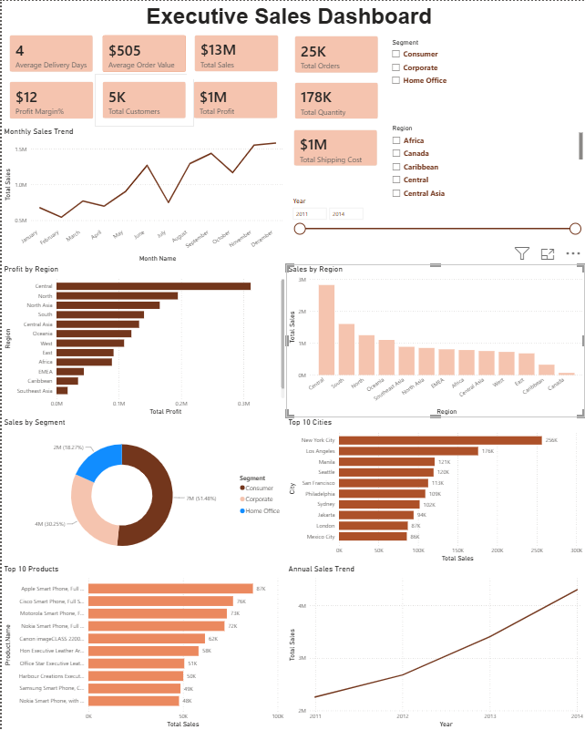

# 📊 Power BI Executive Sales Dashboard

An interactive Executive Sales Dashboard built using **Microsoft Power BI** to analyze sales performance, profitability, customer behavior, and regional trends. The dashboard provides business insights through KPIs, charts, and interactive filters, enabling data-driven decision-making.

---

## 📸 Dashboard Preview

> Replace the image below with your dashboard screenshot after uploading it to the repository.



---

## 🚀 Features

- Executive KPI Dashboard
- Interactive slicers for Year, Region, and Segment
- Sales trend analysis over time
- Regional sales performance
- Regional profit analysis
- Sales distribution by customer segment
- Monthly sales trend visualization
- Top 10 Cities by Sales
- Top 10 Products by Sales
- Fully interactive visual filtering across all charts

---

## 📈 Key Performance Indicators (KPIs)

- Total Sales
- Total Profit
- Total Orders
- Total Customers
- Total Quantity Sold
- Total Shipping Cost
- Average Order Value
- Average Delivery Days
- Profit Margin %

---

## 📊 Dashboard Visualizations

- KPI Cards
- Line Chart (Sales by Year)
- Line Chart (Monthly Sales Trend)
- Clustered Bar Chart (Sales by Region)
- Clustered Bar Chart (Profit by Region)
- Donut Chart (Sales by Segment)
- Bar Chart (Top 10 Cities by Sales)
- Bar Chart (Top 10 Products by Sales)
- Interactive Slicers

---

## 🛠 Tools & Technologies

- Microsoft Power BI
- Power Query
- DAX (Data Analysis Expressions)
- Data Modeling
- Interactive Visualizations

---

## 📂 Dataset

Dataset used: **Global Superstore Dataset**

The dataset includes:

- Orders
- Customers
- Products
- Sales
- Profit
- Quantity
- Shipping Cost
- Region
- Segment
- Order Date
- Ship Date

---

## 📋 DAX Measures Created

```DAX
Total Sales = SUM(superstore[Sales])

Total Profit = SUM(superstore[Profit])

Total Orders = DISTINCTCOUNT(superstore[Order.ID])

Total Customers = DISTINCTCOUNT(superstore[Customer.ID])

Total Quantity = SUM(superstore[Quantity])

Total Shipping Cost = SUM(superstore[Shipping.Cost])

Average Order Value =
DIVIDE([Total Sales],[Total Orders])

Profit Margin % =
DIVIDE([Total Profit],[Total Sales])*100

Average Delivery Days =
AVERAGE(superstore[Delivery Days])
```

---

## 📁 Repository Structure

```
Power-BI-Executive-Sales-Dashboard
│
├── Power BI Executive Sales Dashboard.pbix
├── Superstore[1].csv
├── dashboard.png
├── Profit by region.png
├── Sales by region.png
├── Monthly sales Trend.png
├── Annual Sales Trend.png
└── README.md
```

---

## 💡 Skills Demonstrated

- Power BI Dashboard Development
- Data Cleaning
- Data Modeling
- DAX Calculations
- KPI Design
- Business Intelligence
- Data Visualization
- Interactive Reporting

---

## 🎯 Business Insights

- Monitor executive KPIs in one place
- Identify high-performing regions
- Analyze profitability by region
- Compare sales across customer segments
- Discover top-performing products and cities
- Track yearly and monthly sales trends
- Support data-driven business decisions

---

## 📧 Author

**Rahul Gupta**

- GitHub: https://github.com/rahulgutpa41
- LinkedIn: https://www.linkedin.com/in/rahul-gupta-52a597b3/

---

⭐ If you found this project helpful, consider giving it a star.
Interactive Executive Sales Dashboard built using Microsoft Power BI. Features KPI cards, sales trends, regional analysis, customer segmentation, and interactive slicers.
